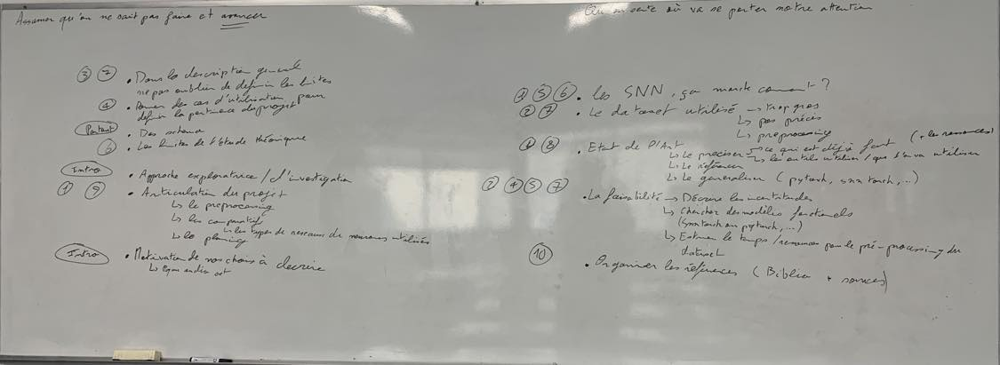

# Project_S9

Seule l'image est importante dans ce doc

Sujet 
1. Etat de l'Art
    - Pour l'instant rien de trouver (GAN utilisant un modèole de spiking neural network)
2. Décrire ce qui nous attends
    - Création d'un GAN
    - Récupération d'une base de donnée de son de voix de personnes (avec des labels)
3. Lister les éléments / les thématiques concernées
4. Voir ce qui nous interesse et s'orienter dans cette direction

Exemple: On peut si on veut d'abord s'interesser au model puis à l'embedding

Pondération: PER -> Expliquer ce que c'est

Grande partie du DO : expliquer ce qu'est un SNN
Ce que F ferait pour le DO:
- Utilisation
- On a trouver ça et on a passé du temps à comprendre comment ça marche (venant et aboutissant - ce que l'on pourra en faire)
- Murir l'affaire avant de contacter Miramond
- Trouver la connectivité entre SNN et reconnaissance de la parole
- Comprendre SNN torch fais partie du travail (A mettre quelque part dans rendu à un moment) -> mettre des explications sur le fonctionnement des SNN
- Documenter les sources
- Contact Miramond, une ou deux slide de présentation du projet, Est-ce que c'est cohérent ? On va dans le mur ?
- On demande pas non plus d'aller ultra en profondeur sur le sujet (electronique, ...), pas besoin d'aller jusqu'à une description approfondi du matériel physique
- Priorité pour l'instant: comprendre comment ça marche - Cas d'utilisation - Différence Pytorch et SNN torch

- Trouver une base de donnée avec une soltuion qui marche déjà (donne une base pour la comparaison), Conseil:
    - On part avec un truc qui existe et qui marche (transformers, ...)
    - Transformer solution "non spikante" en solution 'spikante'

Dans le DO et le Pre-Do: commencer à évaluer le temps pour les tâches. (une plannification des tâches)

- Une des conclusion possible du projet: "a quoi sert SNN torch" ?

**FAISABILITE** - Essayer de ne pas partir à coté / diverger

1. Préciser le sujet
2. Base de donnée adaptée (éventuellement associé avec un modèle fonctionnant à traduire) [1](https://towardsdatascience.com/40-open-source-audio-datasets-for-ml-59dc39d48f06) [2](http://multicomp.cs.cmu.edu/resources/cmu-mosei-dataset/) [3](https://sail.usc.edu/iemocap/) [4](https://paperswithcode.com/datasets?task=speech-recognition)
3. Etat de l'art (ce qui existe déja [1](https://github.com/h-betz/NeuralNetwork) [2](https://arxiv.org/pdf/2302.01194.pdf) [3](https://mediatum.ub.tum.de/doc/1616138/k2eq5dx7s2rkanp176n66686m.Auge2021_Chapter_End-to-EndSpikingNeuralNetwork.pdf) [4](https://cnrs.hal.science/hal-03452737/file/Papier%20Meta%202021.pdf))
4. Différences entre SNN torch et Pytorch