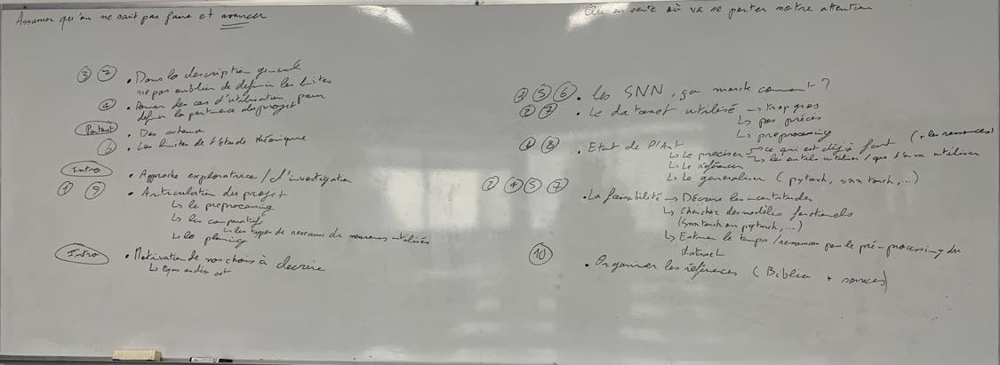

# Project_S9

## Notre plan

1. Introduction - Objectif général
    1. Une intro au SNN (comment ça marche vite fait)
    2. Pourquoi les SNN pour notre projet
    2. Le problème choisit
    3. Les motivations de notre choix
    4. Pourquoi l'audio set
    5. Approche d'exploration - on part de pas grand chose puis on explique
2. Donnée utilisées
    1. Choix du type de donnée d'entrainement
        1. Faisabilité (audio > image - plus simple)
    2. Choix de la base de données 
        1. Copyright
        2. Temps pour le pre-processing, le nettoyage ...
        3. Incertitudes sur la qualité des données, ...
    3. Ouverture sur les autres bases de données
3. Thématique choisie
    1. Les SNN
        1. Définition
        2. Fonctionnement
        3. Avantages / Inconvénients
        4. SNN torch
    2. Les SNN appliqués à la classification audio
        1. Définition
        2. Fonctionnement
        3. Avantages / Inconvénients
    3. Pertinence de ce choix
        1. Definition des venants et aboutissant du projet
        2. Cas d'utilisation pour définir pertinence du projet
4. Etat de l'art
    1. Trouver ce qui existe déjà
        1. En simple réseau de neurone
            1. Entrainé sur le même set de données ou non
        2. En SNN
            1. Entrainé sur le même set de données ou non
        3. Les librairies existantes, les modèles existants
    2. Résultats obtenus qui nous serviront de base pour comparer nos résultats

## Consignes 

La structure du DoW est libre mais nous vous conseillons d’inclure au moins les sections suivantes :
1. Objectif général du projet : décrire à quoi ce projet va servir et quel est le problème métier
visé.
2. Données utilisées : décrire assez précisément les données que vous utiliserez dans votre
projet.
3. Thématique choisie : bref rappel de la thématique principale choisie et sa pertinence pour le
projet.
4. État de l’art : proposer un état de l’art succinct mais précis qui positionne clairement votre
projet par rapport à ce qui existe déjà (littérature, blogs, code sur GitHub, etc.)
5. Objectifs techniques du projet : décrire les articulations techniques principales du projet et
notamment quelles sont les approches techniques envisagées.
6. Étude théorique : décrire une étude théorique qui sera plus particulièrement abordée dans le
projet. Nous vous conseillons que cette étude théorique soit directement liée à la thématique
choisie afin d’éviter une surcharge de travail.
7. Adéquation avec les ressources disponibles : proposer une estimation des ressources
disponibles (temps de travail des étudiants impliqués, ressources informatiques disponibles,
etc.) pour réaliser le projet et positionner ces ressources par rapport aux objectifs techniques
visés. Il est important de bien dimensionner le projet par rapport aux ressources disponibles.
8. Description du démonstrateur final : décrire brièvement le démonstrateur Python qui sera
développé pendant le projet.
9. Planning des tâches à réaliser : proposer un planning réaliste des tâches qui composent votre
projet. La granularité du planning doit être d’environ 2 ou 3 jours. Autrement dit, une tâche
élémentaire du planning doit être réalisable sur environ 3 semaines lorsque le projet a lieu
pendant les semaines de cours et sur environ la moitié d’une semaine lorsque le projet a lieu
à plein temps. La répartition des tâches entre la réalisation du démonstrateur, l’analyse des
données et l’étude théorique est libre mais il est conseillé de proposer une répartition
équilibrée.
10. Bibliographie : elle liste les principales références qui vous ont servi à rédiger le DoW et qui
seront exploitées dans le projet (même si certaines de ces références ne sont pas encore
maitrisées).